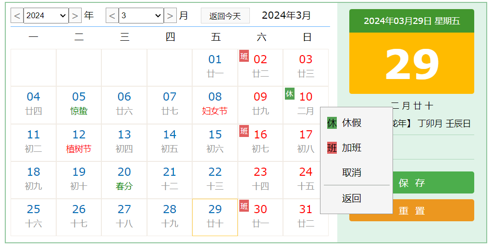

# 日历 calendar-js

### JS 日历插件 实现农历、节气 可自定义加班和休假

### 下载本项目
```
> git clone https://github.com/majiameng/calendar-js
```



###### html：引入calendar.css和calendar.js，需要JQuery的支持

```
<!DOCTYPE html>

<html xmlns="http://www.w3.org/1999/xhtml">

<head runat="server">
    <meta http-equiv="Content-Type" content="text/html; charset=utf-8" />
    <link href="src/calendar.css" rel="stylesheet" />
    <title></title>
</head>

<body>
    <form id="form1" runat="server">
        <div id="calendar">
        </div>
    </form>
    <script src="src/jquery-1.8.3.min.js" type="text/javascript"></script>
    <script src="src/calendar.js" type="text/javascript"></script>
    <script src="src/index.js" type="text/javascript"></script>
</body>

</html>
```

###### js：里边的参数都有默认值。可选则传入
```
$(function() {
    $("#calendar").calendar({
        begin_year: 1900,
        end_year: 2101,
        /*
         * 传入今天的时间
         * 默认：客户端时间
         * 可传入一个服务器的时间
         */
        date: new Date(),
        width: 800,
        height: 400,
        /* 左右框显示的比例 */
        rate: 0.7,
        /*
         * 系统配置[通过API获取]
         * 休假和加班设置
         * JSON格式：Y加年-M加月-D加日
         * 0表示休假 1表示加班
         */
        configDay: {
            "Y2016": {
                "M10": {
                    "D1": 0,
                    "D2": 0,
                    "D3": 0,
                    "D4": 1,
                    "D5": 1
                }
            }
        }
    });
});
```

#### 修改说明

###### 如何获取到本月最新的配置,代码中有注释：
```
/**
 * 保存日历
 * @param Y
 * @param M
 * @param configDayM
 */
function saveConfig(Y, M, configDayM){
    // 2024 3 {D17:0,D24:1}
    console.log(Y, M, configDayM)
    // API存储到云端
}
```

> CSS修改：可通过传入参数改变日历的大小。但是字体大小可能就不太适应了，通过调整CSS中的字体大小修改。其他一些的修改自己看代码都有注释。